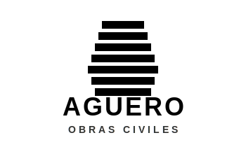
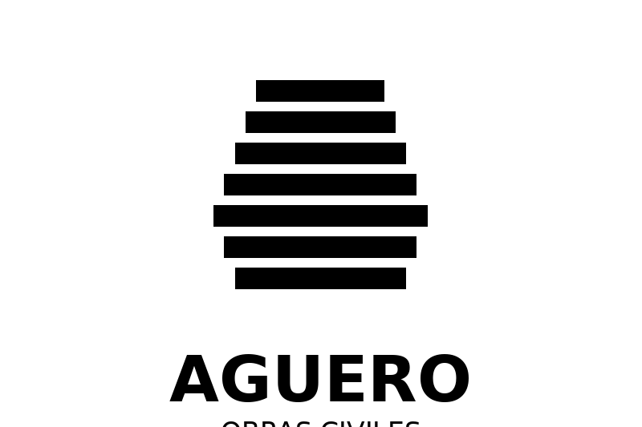

# 🏆 LOGO TOP CHOICE - AGÜERO OBRAS CIVILES
## Versión 1: Profesional Sólido

---

## 📥 DESCARGA COMPLETA

### 🎁 ARCHIVO ZIP (TODO INCLUIDO)
**`logo-aguero-top-choice.zip`** (128 KB)
- 2 archivos SVG (vectoriales)
- 12 archivos PNG (diferentes tamaños)
- **DESCARGÁ ESTE PARA TENER TODO** ⬇️

---

## 📁 CONTENIDO DEL PAQUETE

### 🎨 ARCHIVOS VECTORIALES (SVG)
Calidad infinita, escalables a cualquier tamaño:

✅ **`logo-aguero-bn-v1-negro.svg`** (1.1 KB)
   - Logo negro sobre fondo transparente
   - **Usar en:** Web, documentos, presentaciones

✅ **`logo-aguero-bn-v1-blanco.svg`** (1.1 KB)
   - Logo blanco sobre fondo oscuro
   - **Usar en:** Fondos oscuros, vehículos negros, uniformes oscuros

---

### 🖼️ ARCHIVOS PNG - VERSIÓN NEGRA (Fondo Transparente)

✅ **`logo-aguero-v1-negro-pequeno.png`** (400×267px)
   - Tamaño: ~6 KB
   - **Usar en:** Firmas de email, iconos pequeños

✅ **`logo-aguero-v1-negro-mediano.png`** (800×533px)
   - Tamaño: ~15 KB
   - **Usar en:** Web, presentaciones, documentos digitales

✅ **`logo-aguero-v1-negro-grande.png`** (1200×800px)
   - Tamaño: ~28 KB
   - **Usar en:** Impresión de calidad, banners

✅ **`logo-aguero-v1-negro-extra-grande.png`** (2400×1600px)
   - Tamaño: ~85 KB
   - **Usar en:** Impresión de alta calidad, vallas, gigantografías

✅ **`logo-aguero-v1-negro-cuadrado-512.png`** (512×512px)
   - Tamaño: ~13 KB
   - **Usar en:** Instagram, Facebook (foto de perfil)

✅ **`logo-aguero-v1-negro-cuadrado-1024.png`** (1024×1024px)
   - Tamaño: ~40 KB
   - **Usar en:** Redes sociales en alta calidad

---

### ⚪ ARCHIVOS PNG - VERSIÓN BLANCA (Fondo Oscuro)

✅ **`logo-aguero-v1-blanco-pequeno.png`** (400×267px)
   - **Usar en:** Fondos oscuros, firmas de email con tema oscuro

✅ **`logo-aguero-v1-blanco-mediano.png`** (800×533px)
   - **Usar en:** Presentaciones con fondo oscuro

✅ **`logo-aguero-v1-blanco-grande.png`** (1200×800px)
   - **Usar en:** Impresión sobre superficies oscuras

✅ **`logo-aguero-v1-blanco-extra-grande.png`** (2400×1600px)
   - **Usar en:** Vehículos oscuros, uniformes negros, vallas nocturnas

✅ **`logo-aguero-v1-blanco-cuadrado-512.png`** (512×512px)
   - **Usar en:** Redes sociales con modo oscuro

✅ **`logo-aguero-v1-blanco-cuadrado-1024.png`** (1024×1024px)
   - **Usar en:** Redes sociales en alta calidad, modo oscuro

---

## 🎯 GUÍA RÁPIDA: ¿QUÉ ARCHIVO USAR?

| Lo que querés hacer | Archivo a usar |
|---------------------|----------------|
| **Sitio web** | `logo-aguero-bn-v1-negro.svg` |
| **PowerPoint / Word** | `logo-aguero-v1-negro-mediano.png` |
| **Firma de email** | `logo-aguero-v1-negro-pequeno.png` |
| **Instagram / Facebook** | `logo-aguero-v1-negro-cuadrado-512.png` |
| **Tarjetas de presentación** | `logo-aguero-bn-v1-negro.svg` o PNG extra-grande |
| **Vehículo blanco/claro** | `logo-aguero-v1-negro-extra-grande.png` |
| **Vehículo negro/oscuro** | `logo-aguero-v1-blanco-extra-grande.png` |
| **Uniforme claro** | `logo-aguero-v1-negro-extra-grande.png` |
| **Uniforme oscuro** | `logo-aguero-v1-blanco-extra-grande.png` |
| **Casco** | `logo-aguero-v1-blanco-extra-grande.png` |
| **Valla/Banner** | `logo-aguero-bn-v1-negro.svg` (enviar a imprenta) |
| **Papelería** | `logo-aguero-bn-v1-negro.svg` |

---

## 💻 CÓMO USAR EN TU SITIO WEB

### Opción 1: SVG (Recomendado - Mejor Calidad)
```html

```

### Opción 2: PNG
```html

```

### Opción 3: Responsive (Se adapta al tamaño)
```html
<div style="max-width: 300px;">
  
</div>
```

---

## 📱 REDES SOCIALES

### Instagram
1. Ir a tu perfil
2. Editar perfil
3. Cambiar foto
4. Subir: `logo-aguero-v1-negro-cuadrado-512.png`

### Facebook
1. Ir a tu página
2. Editar foto de perfil
3. Subir: `logo-aguero-v1-negro-cuadrado-512.png`

### LinkedIn
1. Ir a tu página de empresa
2. Editar logo
3. Subir: `logo-aguero-v1-negro-cuadrado-1024.png`

### WhatsApp Business
1. Configuración
2. Perfil de la empresa
3. Subir: `logo-aguero-v1-negro-cuadrado-512.png`

---

## 🖨️ PARA IMPRIMIR

### Tarjetas de Presentación
- **Archivo:** `logo-aguero-bn-v1-negro.svg`
- Enviá el SVG a la imprenta
- Tamaño recomendado: 40-50mm de ancho

### Papelería (Membrete)
- **Archivo:** `logo-aguero-bn-v1-negro.svg`
- Tamaño recomendado: 60-80mm de ancho

### Vallas / Banners / Gigantografías
- **Archivo:** `logo-aguero-bn-v1-negro.svg`
- El SVG se puede escalar a CUALQUIER tamaño sin pérdida de calidad
- Si piden PNG: usar `logo-aguero-v1-negro-extra-grande.png`

### Uniformes / Bordados
- **Archivo:** Enviar SVG a la empresa de bordados
- Si piden PNG: usar extra-grande
- **Blanco** sobre uniformes oscuros
- **Negro** sobre uniformes claros

### Cascos
- **Archivo:** `logo-aguero-v1-blanco-extra-grande.png`
- Tamaño recomendado: 80-100mm
- Normalmente en vinilo blanco

---

## 🔧 HERRAMIENTAS ÚTILES

### Para Abrir/Editar SVG
- **Online Gratis:**
  - Figma (figma.com)
  - Boxy SVG (boxy-svg.com)
  
- **Software Profesional:**
  - Adobe Illustrator (pago)
  - Inkscape (gratis)
  - Affinity Designer (pago único)

### Para Convertir Formatos
- **Online:**
  - CloudConvert.com
  - Convertio.co
  - Online-Convert.com

---

## ❓ PREGUNTAS FRECUENTES

**¿Cuál es la diferencia entre SVG y PNG?**
- **SVG:** Vector, calidad infinita, archivo pequeño, ideal para web e impresión
- **PNG:** Imagen de píxeles, fondo transparente, fácil de usar en cualquier lado

**¿Cuándo uso el negro y cuándo el blanco?**
- **Negro:** Sobre fondos claros (blanco, gris claro, colores claros)
- **Blanco:** Sobre fondos oscuros (negro, gris oscuro, colores oscuros)

**¿Puedo cambiar el tamaño de los PNG?**
- Sí, pero NO lo hagas más grande que el original (perderás calidad)
- Podés hacerlo más pequeño sin problema
- Para tamaños grandes, usá el SVG

**¿Puedo cambiar los colores?**
- Sí! Los SVG se pueden editar fácilmente
- Abrí con un editor de texto y cambiá `fill="#000000"` por el color que quieras

**¿Necesito todos estos archivos?**
- No necesariamente
- El **SVG negro** cubre el 80% de los usos
- Los **PNG** son útiles para redes sociales y cuando no podés usar SVG

---

## 🚀 PRÓXIMOS PASOS

1. ✅ Descargar `logo-aguero-top-choice.zip`
2. ✅ Subir logo SVG a tu sitio web
3. ✅ Actualizar redes sociales (usar PNG cuadrados)
4. ✅ Diseñar tarjetas de presentación
5. ✅ Aplicar en uniformes y vehículos
6. ✅ Crear papelería (membrete, sobres)

---

## 📊 RESUMEN TÉCNICO

| Tipo | Cantidad | Tamaño Total | Uso Principal |
|------|----------|--------------|---------------|
| SVG | 2 | 2.2 KB | Web, impresión profesional |
| PNG Negro | 6 | ~187 KB | Fondos claros, documentos |
| PNG Blanco | 6 | ~187 KB | Fondos oscuros, uniformes |
| **TOTAL** | **14 archivos** | **~376 KB** | Todos los usos |

---

## ✨ CARACTERÍSTICAS DEL DISEÑO

✅ **Moderno y Profesional**
- Diseño limpio y sofisticado
- Transmite solidez y confianza

✅ **Versátil**
- Funciona en cualquier fondo
- Escalable a cualquier tamaño
- Blanco y negro = funciona en color también

✅ **Económico**
- Impresión barata (una tinta)
- Ideal para bordados
- Perfecto para fotocopias

✅ **Atemporal**
- No pasa de moda
- Clásico y elegante
- Larga vida útil

---

**¿Necesitás ayuda?**
Contactá al diseñador con cualquier consulta.

**Versión:** 1.0 - TOP CHOICE  
**Fecha:** Noviembre 2025  
**Total de archivos:** 14
